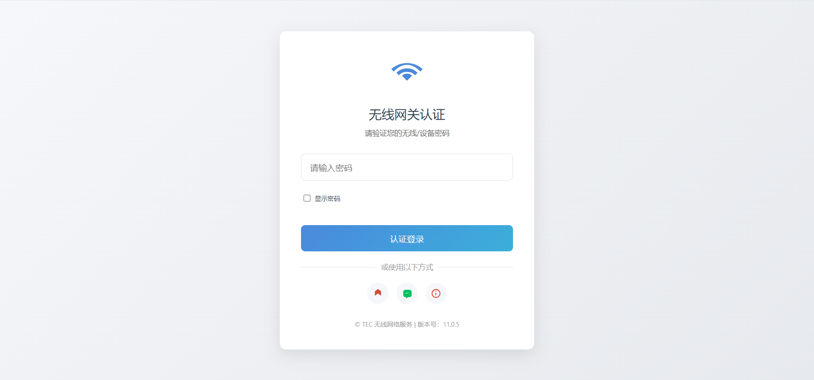

# airgeddon-plugins
airgeddon-plugins

## Portal screenshot

 


## Describe
`modify_no_to_yes.sh`: Support modifying the 9 options in the Evil Twin Attack menu. Do you want to continue with the interface VIF check? Change the default value from no to yes

`https_web_server.sh`: Supports HTTPS type web page forced redirection

`custom_essid.sh`: Support custom fake AP names and channels. When the AP name is hidden, force the request to enter the name in order to continue launching the evil twin attack

`multint.sh`: Support selecting different network cards for DOS and AP, mainly for using network cards that do not support VIF features. What is VIF ?  [here](https://github.com/v1s1t0r1sh3r3/airgeddon/wiki/FAQ%20&%20Troubleshooting#what-is-vif)

`custom_portals.sh`: Support you to customize portal pages

`advance_pid_killing.sh`: Optimize the killing of processes. By default, this plugin is not enabled, **and it doesn't matter if it's not enabled**


## How to use

```bash
# 下载此储存库压缩包

# 解压压缩包

# 将解压的文件放入你的airgeddon插件目录

# 删除多余的文件 LICENSE 与 README.md 等等

# 删除多余的目录 img 与 .git(如果是git clone) 等等

# 这将是最终目录结构
root @ wifi-hack: /home/kali/桌面/dev-work-space/my-airgeddon/airgeddon-11.21/plugins-------------------------------------------------------------------------------------------------------------- main (✓)
➜ tree ./ -L 2
./
├── custom_essid.sh
├── custom_portals
│   ├── ChinaMobile_xxx
│   ├── ChinaNet_xxx
│   ├── ChinaTelecom_xxx
│   ├── ChinaUnicom_xxx
│   ├── Cmcc_GM220_S
│   ├── Cmcc_xxx
│   ├── ESP_xxx
│   ├── General_xxx
│   ├── General_xxx_with_username_Capture
│   ├── Login_xxx
│   ├── Mercury_xxx
│   ├── OpenWRT_EXAMPLE
│   ├── OpenWRT_EXAMPLE_2
│   ├── Router_xxx
│   ├── Tp_link_xxx
│   ├── Update_xxx
│   ├── Wonderful_xxx
│   └── XiaoMi_xxx
├── custom_portals.sh
├── https_web_server.sh
├── missing_dependencies.sh
├── modify_no_to_yes.sh
├── multint.sh
└── plugin_template.sh

20 directories, 7 files
```

